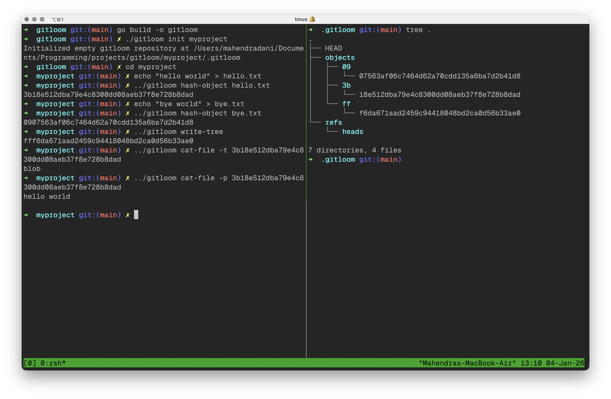

# gitloom - the stupidest version control system

Gitloom is a straightforward, Git-style version control system built in Go. It mimics core Git features like initializing repositories, storing objects, constructing trees, and creating commits. As a fun learning project, it demystifies Git's internals and the magic of content-addressable storage—because who doesn't love playing pretend VCS without accidentally nuking your codebase?



The goals behind building this project include:
1. Sharpening Go skills through a practical, hands-on build.
2. Understand Git's inner workings by coding it from the ground up.
3. Learning test-driven development—penning tests upfront, then crafting the code to pass them.
4. Building in Public : updates on my [X](https://x.com/MahendraDani09/status/1983840117212303407?s=20).

# Roadmap
1. Initialize a Gitloom repository (`gitloom init`)
    - [x] create directories and files - `.gitloom`, `.gitloom/objects`, `.gitloom/refs` and `.gitloom/HEAD` 
    - Check out the [demo](https://x.com/MahendraDani09/status/1983840117212303407?s=20) in action.
2. Create objects from files (`gitloom hash-object <file>`)
    - [x] convert a file into a blob object
    - [x] prepend a header blog <size>\0 to the file content.
    - [x] compute SHA-1 hash of the blob.
    - [x] store the compressed blob in `.gitloom/objects/<hash_prefix>/<hash_suffix>`
 
3. Display object contents (`gitloom cat-file -[p|s|t] <file>`)
    - [x] read size, content and types of object from hash.
    - [x] Read files using buffered IO.
    - Check out the [demo](https://x.com/MahendraDani09/status/1984290151808549315?s=20) in action.

4. Build trees from directories (`gitloom write-tree`)
    - [x] commit trees to the repository
    - [x] recursively walk through directories, hash objects and write the tree

5. Commit trees (`gitloom commit-tree`)
    - [ ] Create a commit object from the hash of a tree 

# Installation
1. Ensure Go compiler is installed, if not follow the [official docs](https://go.dev/)
2. Clone this repository:
```
git clone https://github.com/MahendraDani/gitloom
```
3. Build the project
```
go build -o gitloom
```

You're all set to start creating Gitloom repositories!

